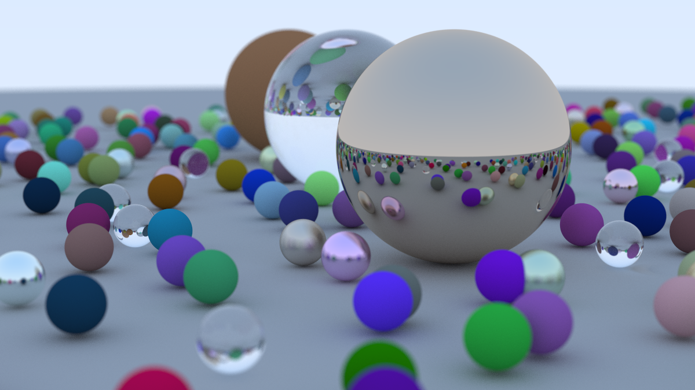

# Ray Tracing using Rust

In this project I am building ray tracing in Rust by following a turtorial series.

## Ray Tracing in One Weekend

First I adapted the [Ray Tracing in One Weekend](https://raytracing.github.io/books/RayTracingInOneWeekend.html) project using Rust.
This yielded this final render as result.

	

## Ray Tracing: The Next Week

Currently I am working on adapting the [next book](https://raytracing.github.io/books/RayTracingTheNextWeek.html) in the series.
