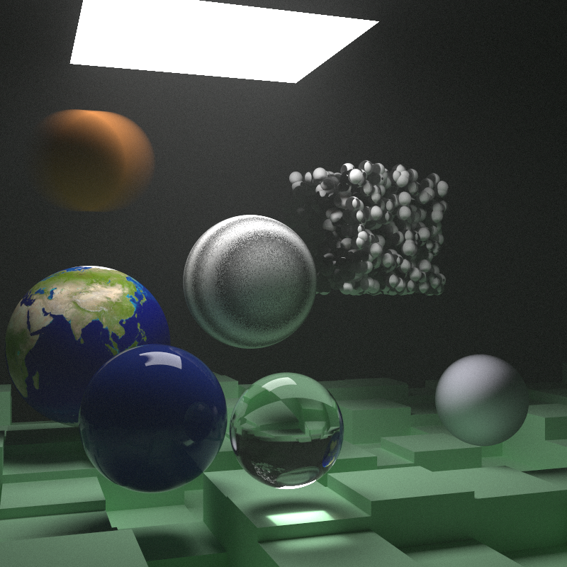

# Ray Tracing using Rust

In this project I am building ray tracing in Rust by following the “Ray Tracing in One Weekend Series” by Peter Shirley, Trevor David Black and Steve Hollasch.

## Ray Tracing in One Weekend

First I adapted the [_Ray Tracing in One Weekend_](https://raytracing.github.io/books/RayTracingInOneWeekend.html) project using Rust. This yielded this final render as result.

	

## Ray Tracing: The Next Week

After that I adapted [_Ray Tracing: The Next Week_](https://raytracing.github.io/books/RayTracingTheNextWeek.html), the next book in the series. The result was a final scene to test all newly implemented features.

	

